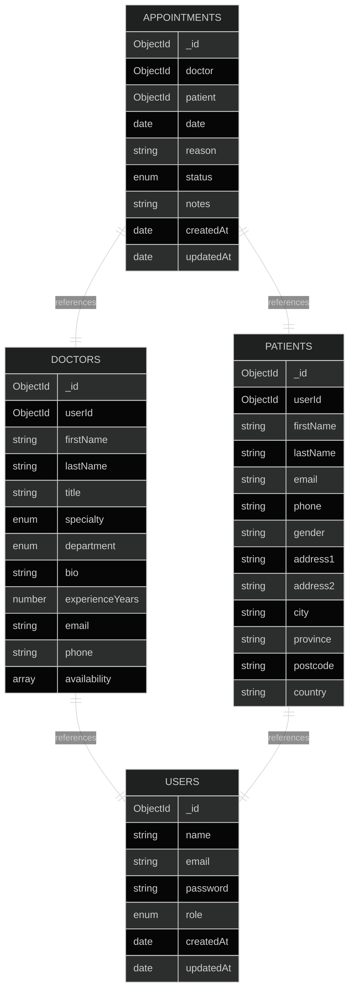

```mermaid
%%{init: {'theme': 'dark'}}%%
%% Database: drmeet
erDiagram
USERS {
    ObjectId _id
    string name
    string email
    string password
    enum role
    date createdAt
    date updatedAt
}

    DOCTORS {
        ObjectId _id
        ObjectId userId
        string firstName
        string lastName
        string title
        enum specialty
        enum department
        string bio
        number experienceYears
        string email
        string phone
        array availability
    }

    PATIENTS {
        ObjectId _id
        ObjectId userId
        string firstName
        string lastName
        string email
        string phone
        string gender
        string address1
        string address2
        string city
        string province
        string postcode
        string country
    }

    APPOINTMENTS {
        ObjectId _id
        ObjectId doctor
        ObjectId patient
        date date
        string reason
        enum status
        string notes
        date createdAt
        date updatedAt
    }

    DOCTORS ||--|| USERS : "references"
    PATIENTS ||--|| USERS : "references"
    APPOINTMENTS ||--|| DOCTORS : "references"
    APPOINTMENTS ||--|| PATIENTS : "references"


```
